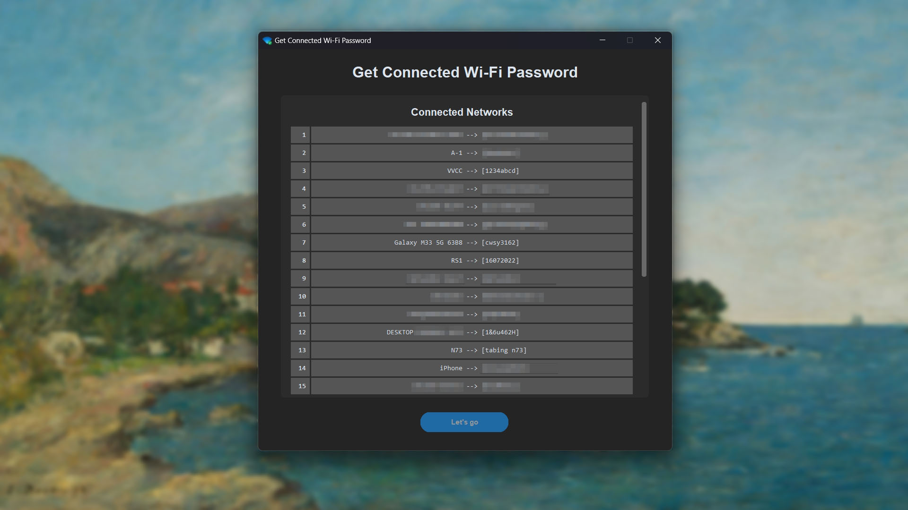

# Get Connected WiFi Password Application using Python customtkinter



## How to run without Python
1. Download `Connected Wi-Fi.exe` inside `dist` folder
2. Run the `Connected Wi-Fi.exe` on your computer


## Python requirment library
```bash
pip install tkinter
pip install customtkinter
pip install pyinstaller
```

## How to compile `.py` to `.exe`
Make sure to install `pyinstaller` on your pip

```bash
# Compile normal
pyinstaller main.py

# Compile with no terminal
pyinstaller main.py --windowed

# Compile into single file and no terminal
pyinstaller main.py --onefile --windowed

# Compile into single file, no terminal, and set icon app
pyinstaller main.py --onefile --windowed --icon="icons8-wifi-96.ico"

# Compile into single file, no terminal, set icon app, and set name for the app after compiled
pyinstaller main.py --onefile --windowed --icon="icons8-wifi-96.ico" --name="Connected Wi-Fi"
```
