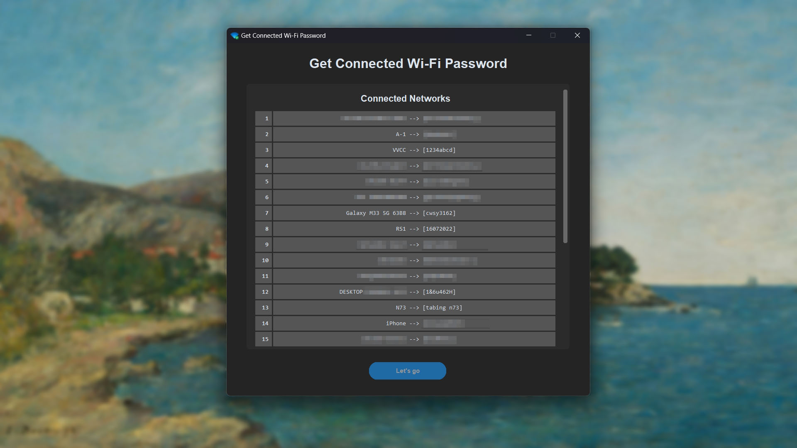

# Get Connected WiFi Password Application using Python customtkinter



## How to run without Python
1. Download this repository to zip
2. Extract the zip file you've donwloaded
3. Go to `ouput` --> `Connected Wi-Fi`
3. Finally, run the `Connected Wi-Fi.exe` on your computer


## Python requirment library
```bash
pip install tkinter
pip install customtkinter
pip install pyinstaller
pip install auto-py-to-exe
```


## How to compile `.py` to `.exe` (pyinstaller)
```bash
# Compile normal
pyinstaller main.py

# Compile with no terminal
pyinstaller main.py --windowed

# Compile into single file and no terminal
pyinstaller main.py --onefile --windowed

# Compile into single file, no terminal, and set icon app
pyinstaller main.py --onefile --windowed --icon="icons8-wifi-96.ico"

# Compile into single file, no terminal, set icon app, and set name for the app after compiled
pyinstaller main.py --onefile --windowed --icon="icons8-wifi-96.ico" --name="Connected Wi-Fi"
```

> This project compiled using `auto-py-to-exe`. I recommend to compile any python file using `auto-py-to-exe` than `pyinstaller`.
